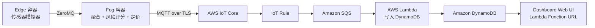
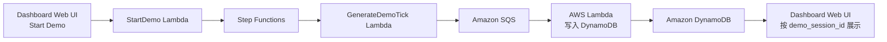

# 项目完整中文说明

## 1. 项目是什么

本项目是一个面向 **Fog and Edge Computing** 课程作业构建的完整原型系统，主题是：

**基于驾驶行为传感器数据的实时车险风险评估与动态定价**

项目目标不是做一个传统的数据分析脚本，而是实现一条完整的 **Edge -> Fog -> Cloud** 数据链路，并满足以下课程要求：

- 模拟 3-5 种不同类型的传感器
- 在 fog 层做真实的数据处理，而不是简单透传
- 在公有云上实现可扩展后端
- 提供可视化 dashboard
- 具备基本的工程化能力，例如 Docker、测试、CI/CD、云部署

## 2. 项目的核心思想

这个系统把“驾驶行为数据”看成一个实时流处理问题：

- **Edge**：模拟车上的传感器数据
- **Fog**：在本地先做聚合、分析、风险评分和保费倍率计算
- **Cloud**：负责弹性接入、存储、查询和可视化

业务逻辑上，系统会根据驾驶过程中的速度、加速度、制动强度、转向波动和车道偏移等指标，计算：

- `risk_score`
- `premium_multiplier`

它们分别表示：

- 驾驶风险分数
- 当前保费调整倍率

## 3. 系统总体架构

### Coursework 主链路



### Demo Mode 旁路链路



这两条链路的关系是：

- **主链路**用于 coursework 的 edge/fog/cloud 设计
- **demo mode** 是附加功能，用于网页一键演示
- demo mode **不会替代** coursework 的主链路

## 4. 为什么要这样分层

### 4.1 Edge 层

Edge 代表离数据源最近的一层。在这个项目中，它不是真实车载硬件，而是：

- 一个本地 Python 模拟器
- 运行在 Docker 容器中
- 负责生成模拟传感器事件

Edge 不做复杂业务逻辑，只做：

- 读取数据模板
- 生成时序事件
- 补充时间戳与元数据
- 发送给 fog

### 4.2 Fog 层

Fog 是这门课里最重要的一层。它代表比云更靠近数据源、但比 edge 更强的处理节点。

在本项目中，fog 负责：

- 接收 edge 的事件批次
- 做窗口聚合
- 提取驾驶风险特征
- 计算风险分数与保费倍率
- 将增强后的结果发送到云端

这意味着上传到云端的已经不是“原始碎片化传感器事件”，而是 **可消费的业务指标**。

### 4.3 Cloud 层

Cloud 层负责：

- 安全接入
- 队列解耦
- 弹性处理
- 时序存储
- 可视化查询

这里采用 AWS 的原因是：

- IoT Core 与 MQTT 很匹配
- SQS + Lambda 非常适合讲“scalable backend”
- DynamoDB 非常适合时间序列指标查询
- Lambda Function URL 对 Python Dashboard 部署成本低

## 5. 数据集在项目中的角色

本项目没有把 Kaggle 数据集当成“原生连续时序传感器日志”，而是把它当成：

**驾驶行为模板库**

也就是说：

- 原始 CSV 每一行是一个行为快照
- 系统不会直接逐行原样上传
- 系统会根据这些行生成带时间戳的连续模拟流

这样做的好处：

- 更符合课程要求中的传感器模拟
- 不受限于数据集是否本来就是 time-series
- 易于解释和实现

## 6. 传感器设计

项目使用 5 种逻辑传感器类型：

1. `speed`
2. `acceleration`
3. `brake_intensity`
4. `steering_variability`
5. `lane_deviation`

这里要注意三种不同概念：

- **sensor type**：传感器类型
- **sampling frequency**：采样频率
- **dispatch rate**：发送频率

当前推荐配置：

- simulation tick：`10 Hz`
- speed：`5 Hz`
- acceleration：`10 Hz`
- brake_intensity：`5 Hz`
- steering_variability：`5 Hz`
- lane_deviation：`2 Hz`
- dispatch interval：`1 秒`
- fog window：`5 秒`

## 7. 模拟数据是怎么生成的

### 7.1 两行插值法

项目采用的是 **两行插值法**。

基本逻辑：

1. 按行为类别（`safe/aggressive/distracted`）分组数据
2. 每辆车在当前行为类中选两条记录：`row_a` 和 `row_b`
3. 在一个固定窗口内，例如 5 秒，从 `row_a` 平滑过渡到 `row_b`
4. 各传感器按各自频率从“当前插值状态”中采样
5. 再给采样值加一点随机扰动，使曲线更像真实数据

简化公式：

```text
value(t) = row_a.value + alpha * (row_b.value - row_a.value) + noise
```

其中：

- `alpha` 表示当前插值进度
- `noise` 表示小幅随机扰动

### 7.2 为什么不用“随机抽一行直接发”

因为那样虽然简单，但会导致：

- 数据跳变明显
- 不像连续驾驶过程
- 难以解释为真实传感器流

而插值法的优点是：

- 更平滑
- 更像真实 driving telemetry
- 实现成本仍然可控

## 8. Edge 模块详解

### 8.1 关键文件

- `edge/dataset_loader.py`
- `edge/sensors.py`
- `edge/app.py`
- `edge/config.yaml`

### 8.2 `dataset_loader.py`

这个模块负责：

- 读取 CSV
- 识别字段名别名
- 统一映射到项目内部字段
- 按行为类别分组

因为 Kaggle 数据集的列名可能和你的样例不同，所以这里做了 alias 匹配。

### 8.3 `sensors.py`

这个模块是 edge 的核心。

它定义了：

- `SensorConfig`
- `FleetConfig`
- `VehicleState`
- `FleetSimulator`

其中 `FleetSimulator` 负责：

- 初始化虚拟车队
- 选择行为类别
- 选择 `row_a` 和 `row_b`
- 推进插值窗口
- 按各传感器频率生成事件

### 8.4 `app.py`

这是 edge 的启动入口。

它负责：

- 读取配置
- 加载数据集
- 创建模拟器
- 建立 ZeroMQ PUSH socket
- 每个 dispatch interval 将当前批次事件发给 fog

它输出的不是单条原始 CSV 记录，而是：

- 一个 `SensorBatch`
- 其中包含多个 `SensorEvent`

## 9. Fog 模块详解

### 9.1 关键文件

- `fog/processor.py`
- `fog/mqtt_publisher.py`
- `fog/buffer.py`
- `fog/app.py`

### 9.2 `processor.py`

这里实现了 fog 的核心窗口处理逻辑。

主要职责：

- 按 `window_seconds` 对事件分桶
- 计算窗口内统计指标
- 生成 `AggregatedWindow`

当前提取的指标包括：

- `avg_speed_kmh`
- `max_acceleration_ms2`
- `harsh_brake_count`
- `steering_stddev`
- `lane_departure_count`
- `risk_score`
- `premium_multiplier`

### 9.3 风险评分逻辑

风险评分在 `common/pricing.py` 中实现。

它使用可解释规则，而不是黑盒模型：

- 速度越高，风险越高
- 最大加速度越大，风险越高
- 急刹次数越多，风险越高
- 转向标准差越大，风险越高
- 车道偏离次数越多，风险越高

风险分数会被归一化到 `0.0 - 1.0`，然后再得到：

```text
premium_multiplier = 1.0 + 0.5 * risk_score
```

### 9.4 `mqtt_publisher.py`

这个模块提供两种发布模式：

- `ConsolePublisher`
- `AwsIotMqttPublisher`

默认本地运行使用 `console`，这样可以在没有 AWS 的时候先验证 fog 逻辑。

一旦切换到 AWS 模式，就会通过 MQTT over TLS 发布到 AWS IoT Core。

### 9.5 `buffer.py`

这个模块提供最基本的本地失败缓冲机制：

- 如果 MQTT 发布失败
- 先把 `AggregatedWindow` 写到本地 spool 文件
- 下次循环时优先重试发送

这可以体现 fog 节点在网络波动下的鲁棒性。

## 10. 共享模型层

### 10.1 `common/models.py`

这个模块定义项目各层共享的数据结构：

- `SensorEvent`
- `SensorBatch`
- `AggregatedWindow`

它的作用是统一 edge、fog、ingest Lambda 的消息格式。

### 10.2 `common/pricing.py`

这个模块定义：

- 风险阈值
- 风险输入
- 风险评分函数
- 保费倍率函数

这样可以避免把定价逻辑分散在多个模块里。

## 11. 云端后端详解

### 11.1 `cloud/lambda_ingest/app.py`

这是从 SQS 写入 DynamoDB 的 Lambda。

职责：

- 从 SQS 读取消息
- 校验字段是否齐全
- 自动补默认 `mode`
- 将 payload 转为 DynamoDB multi-measure record
- 写入 `driver_pricing.telemetry_windows`

这个 Lambda 同时服务两条路径：

- coursework 主链路
- demo mode

也就是说 demo mode 是复用现有 ingest 逻辑的，而不是另起一套后端。

### 11.2 为什么使用 DynamoDB

因为写入的数据本质上是：

- 按时间窗口聚合后的遥测指标
- 需要按时间范围查询
- 适合画折线图与行为趋势图

这正是时序数据库擅长的场景。

## 12. Dashboard 前端详解

### 12.1 为什么选 Dash

本项目选择 Dash 的原因很实际：

- 主栈本身就是 Python
- 数据可视化开箱即用
- 与 boto3 集成简单
- 容器化后部署到 Lambda Function URL 成本低

### 12.2 `cloud/dashboard/queries.py`

这个模块负责所有查询逻辑，包括：

- 列出 production 车辆列表
- 查询某辆车最近指标
- 查询某个 demo session 的指标
- 查询 demo session 状态

### 12.3 `cloud/dashboard/app.py`

这是 Dash 应用入口，负责：

- 生成页面布局
- 管理车辆下拉框
- 定时刷新图表
- 启动和停止 demo session
- 在 production 和 demo 两种视图间切换

### 12.4 页面逻辑

默认情况下：

- 页面展示 production 数据
- 即本地 edge/fog 推到 AWS 的主链路结果

当用户点击 `Start Demo` 时：

- 页面会触发 demo Lambda
- 保存 `demo_session_id`
- 后续刷新时按该 session 查询 demo 数据

这保证了：

- coursework 功能还在
- demo 功能又能网页一键体验

## 13. Demo Mode 详解

### 13.1 为什么需要 demo mode

coursework 主链路更强调 edge/fog/cloud 架构本身。  
但如果你希望网页可以“一键演示”，就需要一条不依赖本地容器的云端模拟路径。

于是项目增加了：

- `start_demo.py`
- `generate_demo_tick.py`
- `stop_demo.py`
- `session_store.py`

### 13.2 `start_demo.py`

职责：

- 生成 `demo_session_id`
- 创建 DynamoDB session
- 启动 Step Functions 状态机

### 13.3 `generate_demo_tick.py`

职责：

- 读取 session 状态
- 生成当前 tick 的 demo 遥测窗口
- 发到 SQS
- 更新 session 的车辆状态和 tick 计数

### 13.4 `stop_demo.py`

职责：

- 停止对应状态机执行
- 把 session 标记为 `STOPPED`

### 13.5 `session_store.py`

这个模块是后来为稳定性专门加的。

原因是：

- DynamoDB 对嵌套 `float` 序列化不友好
- demo session 内部又需要保存车辆插值状态

因此这里做了：

- session 的序列化
- 嵌套车辆状态转 JSON 存储
- DynamoDB 读写时的类型恢复

这能保证 demo mode 在 AWS 上真正可运行，而不仅仅是在本地通过测试。

## 14. 基础设施模板详解

### 14.1 `infra/template.yaml`

这是整个项目的 AWS SAM 模板。

它负责创建：

- SQS 队列
- DynamoDB database/table
- ingest Lambda
- demo mode 相关 Lambda
- Step Functions
- DynamoDB demo session 表
- IoT Topic Rule
- Dashboard Lambda function
- Lambda Function URL
- IAM roles

### 14.2 为什么现在只需要一次 SAM 部署

因为 dashboard 不再通过容器托管服务运行，而是直接由 Lambda 提供网页和 JSON API。

所以部署流程是：

1. 先 `sam deploy` 创建后端资源和 dashboard Lambda
2. 再通过 AWS CLI 创建或更新 dashboard 的 Function URL
3. 最后补充公网调用权限

## 15. CI/CD 详解

### 15.1 `ci.yml`

CI 负责：

- 安装 Python 依赖
- 运行 `ruff`
- 运行 `pytest`
- 校验 SAM 模板
- 执行 `sam build`
- 构建 edge、fog、dashboard 镜像

### 15.2 `deploy.yml`

CD 负责：

- 配置 AWS 凭证
- 执行 `sam build`
- 部署基础设施和 dashboard Lambda
- 获取 `DashboardFunctionName`
- 创建或更新 Function URL
- 补充公网访问权限

### 15.3 为什么这套流程合适

因为它足够工程化，但又没有复杂到偏离 coursework 主体。

## 16. 本地运行逻辑

### 16.1 Docker Compose

本地通过 `docker-compose.yml` 启动两个容器：

- `edge`
- `fog`

默认情况下：

- edge 发给 fog
- fog 只把结果打印到控制台

这适合先验证：

- 模拟器是否正常
- fog 聚合逻辑是否正确
- 风险评分是否正常

### 16.2 切换到 AWS

当你准备接入 AWS 时：

- 把 fog 的 `MQTT_MODE` 切成 `aws_iot`
- 配置 AWS IoT Core endpoint/certificate/key

这样就会从本地演示模式切换到真正的云端链路。

## 17. 当前已具备的验证

当前仓库已经包含：

- 风险评分单元测试
- fog 聚合测试
- edge 模拟器测试
- demo session 序列化测试
- demo 生成器测试

并且已经通过：

- `ruff check .`
- `pytest`
- `sam validate`

## 18. 从零接手本项目的人应该先看什么

如果你第一次接手这个仓库，建议按下面顺序阅读：

1. `README.md`
2. `ARCHITECTURE_CN.md`
3. `common/models.py`
4. `edge/sensors.py`
5. `fog/processor.py`
6. `cloud/lambda_ingest/app.py`
7. `cloud/dashboard/app.py`
8. `infra/template.yaml`

这个顺序能帮助你先建立全局认知，再进入细节。

## 19. 项目的边界与现实限制

这个项目是课程作业级系统，不是生产级保险平台。

因此它故意做了以下取舍：

- 使用解释型规则而不是复杂 ML 模型
- Dashboard 直接查询 DynamoDB，而不是再做独立 API 服务
- demo mode 用 Lambda 生成聚合窗口，而不是完全复刻本地 edge/fog 进程
- IoT Core device certificate 仍建议手工 bootstrap

这些取舍不是缺点，而是为了：

- 保证作业能完成
- 保证架构逻辑清晰
- 保证系统能演示、能部署、能解释

## 20. 结论

这个项目的本质不是“一个页面”或者“一个模型”，而是一套完整的数据链路系统：

- 本地模拟传感器
- 本地 fog 聚合与定价
- AWS 弹性后端
- 时序存储
- 云端 dashboard
- 可选的一键 demo mode

如果你是第一次接触这个项目，只要把握住下面这条主线，就能理解整个系统：

**驾驶行为模板 -> 边缘传感器事件 -> fog 聚合与风险定价 -> 云端解耦处理 -> 时序存储 -> dashboard 展示**
