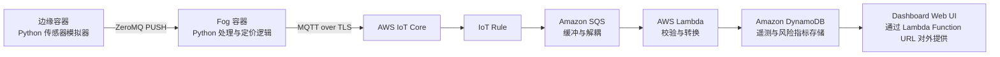
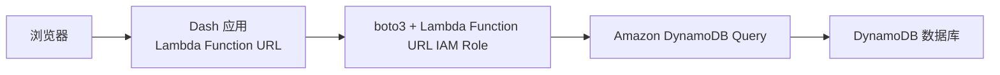
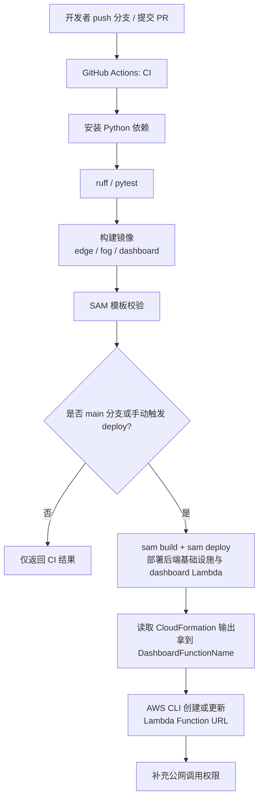

# 雾计算与边缘计算课程项目指南

## 1. 推荐项目题目

**基于边缘/雾处理与 AWS IoT 的实时车险定价系统**

## 2. 为什么这个题目适合作业

这个题目和作业要求匹配度很高，因为它同时包含：

- 3-5 种模拟传感器数据
- 有实际处理逻辑的 fog 层
- 可扩展的云端后端
- 可视化仪表盘
- 清晰的业务场景：基于驾驶行为的保险风险定价

如果范围控制得当，这个题目在截止日期前是完全可完成的。

## 3. 你的项目如何对应作业要求

根据作业说明：

- 传感器层：模拟车辆/驾驶行为遥测数据
- fog 层：接收、处理并转发传感器数据
- 后端层：可扩展的云端处理与仪表盘
- 部署要求：必须部署到公有云
- 报告要求：6-8 页 IEEE 双栏格式
- 演示要求：4 分钟以内

作业原文：

- `/Users/peterlynch/Desktop/Fog and Edge Computing/FEC Sem2 2026 Project v1.pdf`

## 4. 推荐系统架构

你当前的理解方向是对的，但有一个关键补充：

**AWS IoT Core 只是数据接入入口，不是完整后端。**

在 IoT Core 后面，你还需要：

- 可扩展的数据处理
- 持久化存储
- 仪表盘服务

### 推荐最终架构



## 5. 技术选型

### 本地 Edge/Fog 层

- Python 3.11+
- Docker + Docker Compose
- ZeroMQ（`pyzmq`）用于 edge 到 fog 通信
- `paho-mqtt` 用于 fog 向 AWS IoT Core 发送 MQTT 消息
- `pydantic` 用于消息结构校验

### AWS 云端

- AWS IoT Core：MQTT 数据接入
- IoT Rule：路由消息
- Amazon SQS：消息缓冲与解耦
- AWS Lambda：弹性处理
- Amazon DynamoDB：时序数据存储
- Lambda Function URL：对外提供仪表盘网页入口
- CloudWatch Logs：日志和可观测性

## 6. 传感器模型设计

建议你使用 **5 种主要传感器类型**，这样可以更稳妥地满足作业要求中的 “3-5 different sensor types”：

1. 速度传感器
2. 加速度传感器
3. 制动强度传感器
4. 转向波动传感器
5. 车道偏移传感器

这里需要明确区分三个概念：

- **sensor type**：传感器类型，例如 speed、acceleration、brake intensity
- **sampling frequency**：该类型传感器每秒产生多少次采样
- **dispatch rate**：edge 向 fog 发送消息的频率，或批量发送间隔

因此，更安全的作业解释是：

- 你需要实现 **3-5 种不同类型的传感器**
- 每种传感器的 **frequency 和 dispatch rate 都可配置**
- 不能把“同一种传感器在不同频率下运行”当成不同 sensor types

你给出的 Kaggle 数据集最合适的定位方式是：

**把它作为传感器模拟器的数据来源，而不是说它本身就是原始实时传感器流。**

数据集链接：

- [Vehicle Telemetry for Driver Behavior Analysis](https://www.kaggle.com/datasets/sonalshinde123/vehicle-telemetry-for-driver-behavior-analysis)

根据数据集描述，它包含三类驾驶行为：

- Safe
- Aggressive
- Distracted

并且包含与以下行为有关的字段：

- speed
- acceleration
- braking intensity
- steering variability
- lane deviation
- headway distance
- reaction time

### 推荐模拟数据的方法：两行插值法

由于该数据集更适合作为**行为模板库**，而不是原生连续时序数据，因此推荐使用“两行插值法”来生成更像真实传感器的数据流。

核心思路：

- 每辆虚拟车维护一个当前行为状态，例如 `safe`、`aggressive`、`distracted`
- 从该行为类别中选出两条记录：`row_a` 和 `row_b`
- 在一个固定时间段内，例如 5 秒，将 `row_a` 平滑过渡到 `row_b`
- 各传感器在这段时间内按自己的采样频率读取插值后的数值
- 采样值再加上一个很小的随机扰动，使曲线更自然

推荐步骤：

1. 初始化虚拟车辆的 `vehicle_id`、`driver_id`、`trip_id` 和 `behavior_state`
2. 从当前行为类别中选取 `row_a`
3. 再从同一行为类别中选取 `row_b`
4. 在 5 秒插值窗口内，对 speed、acceleration、brake intensity、steering variability、lane deviation 做线性插值
5. 按各传感器各自频率生成事件，并附加 `timestamp`、`sequence_id`
6. 一个插值窗口结束后，将 `row_b` 变为新的 `row_a`，再抽取下一条 `row_b`

一个简化的插值形式如下：

```text
value(t) = row_a.value + alpha * (row_b.value - row_a.value) + noise
```

其中：

- `alpha` 在一个插值窗口内从 0 逐步变化到 1
- `noise` 是一个小扰动，用于避免生成的数据过于机械

这个方法的优点是：

- 比“随机抽一行立刻发送”更像连续驾驶过程
- 实现难度仍然可控
- 很适合解释为 synthetic sensor stream generation

## 7. Edge 层应该做什么

Edge 容器只负责模拟数据产生和发送，不要把复杂逻辑放在这里。

实现上可以是：

- 一个 edge 容器
- 一个传感器模拟器进程
- 在同一个进程里模拟 5 种逻辑上传感器

这并不要求你准备 5 个物理设备，也不要求 5 个独立容器。

### Edge 层职责

- 读取数据集
- 维护虚拟车辆状态和行为类别
- 为每辆车选择 `row_a` 和 `row_b`
- 对两条模板记录做插值，生成连续状态
- 按可配置频率发送事件
- 为每条消息补充元数据：`vehicle_id`、`driver_id`、`trip_id`、`timestamp`、`sequence_id`
- 通过 ZeroMQ 发送到 fog

### 推荐频率分层设计

建议把频率拆成 4 层理解：

- **simulation tick**：内部仿真时钟，用来推进插值过程
- **sensor sampling frequency**：各传感器自身的采样频率
- **dispatch rate**：edge 向 fog 发送批次消息的频率
- **fog aggregation window**：fog 汇总和计算风险分数的窗口

推荐配置：

- simulation tick：10 Hz
- speed：5 Hz
- acceleration：10 Hz
- brake intensity：5 Hz
- steering variability：5 Hz
- lane deviation：2 Hz
- dispatch interval：1 秒 1 次
- fog aggregation window：5 秒

这样设计的含义是：

- edge 内部每 100ms 更新一次车辆插值状态
- 各传感器按自己的采样频率读取当前状态
- edge 每 1 秒把这一秒内采样到的事件打包发送给 fog
- fog 收到连续 5 个批次后，按 5 秒窗口做一次聚合和定价计算

### 为什么这组频率合理

- speed 变化中等快，5 Hz 足够体现实时性
- acceleration 对驾驶风格更敏感，10 Hz 更合适
- brake intensity 如果只有 2 Hz，容易漏掉短时急刹，因此建议 5 Hz
- lane deviation 变化一般较慢，但 1 Hz 略低，2 Hz 更稳妥
- 1 秒 dispatch 可以减少消息碎片，同时保持较强实时性
- 5 秒 fog 窗口可以平滑短时波动，使 risk score 和 premium multiplier 更稳定

### 推荐发送策略

- dispatch interval：每 1 秒向 fog 发送一次
- 或者每累计 `N` 条事件后发送一批
- 这两个参数都应配置化，方便你在演示和报告里说明系统具备可调性

你可以采用如下两层发送逻辑：

- 各传感器按自身 frequency 采样
- edge 按统一 dispatch interval 打包后发送给 fog

这与 fog 的 5 秒聚合窗口并不冲突，因为：

- `dispatch = 1 秒` 是传输节奏
- `fog window = 5 秒` 是计算节奏

## 8. Fog 层应该做什么

这是整个项目在学术上最关键的一层。fog 节点不能只是“转发器”。

### Fog 层职责

- 接收 ZeroMQ 消息
- 校验并规范化 payload
- 对噪声数据做平滑处理
- 按 5 秒窗口聚合
- 提取驾驶风险特征
- 计算实时保险风险分数
- 云端不可用时本地缓存待发送数据
- 通过 MQTT 将增强后的事件发送到 AWS IoT Core

### 推荐在 fog 层计算的特征

- average speed
- max acceleration
- harsh brake count
- steering standard deviation
- lane departure count
- risk score
- premium multiplier

### 推荐定价逻辑

建议使用**可解释的规则公式**，不要把核心放在黑盒机器学习上。

```text
risk_score =
  0.30 * normalized_speed +
  0.20 * normalized_acceleration +
  0.25 * normalized_braking +
  0.15 * normalized_steering_variability +
  0.10 * normalized_lane_deviation

premium_multiplier = 1.0 + (0.5 * risk_score)
estimated_premium_per_trip = base_trip_price * premium_multiplier
```

这样做有几个好处：

- 更容易实现
- 更容易解释
- 更适合作为课程作业报告内容

## 9. 云端后端设计

### 为什么这个后端设计足够达到 MSc 作业标准

- IoT Core 负责安全接入 IoT 遥测数据
- SQS 提供削峰填谷和解耦
- Lambda 提供无服务器弹性扩展
- DynamoDB 适合存储时序遥测数据
- Lambda Function URL 能快速部署可扩展仪表盘

这套组合可以支撑你在报告里做出合理的架构分析与论证。

### 数据流转流程

1. fog 以 MQTT 向主题 `insurance/vehicle/{vehicle_id}/telemetry` 发布增强后的遥测数据
2. AWS IoT Core 接收该消息
3. IoT Rule 将消息转发到 Amazon SQS
4. Lambda 以批处理方式从 SQS 消费消息
5. Lambda 对消息做校验和转换
6. Lambda 将处理结果写入 DynamoDB
7. 仪表盘从 DynamoDB 查询并展示风险和定价信息

## 10. 仪表盘范围建议

不要做过于复杂的前端。小而完整的仪表盘更适合作业。

### 建议页面

1. **实时总览**
   - 当前 trip 遥测值
   - 最新 risk score
   - 当前 premium multiplier

2. **驾驶员摘要**
   - 平均速度趋势
   - 急刹车次数
   - 车道偏移趋势
   - 风险分数历史曲线

3. **行为分析**
   - safe / aggressive / distracted 会话数量
   - 主要风险因素分布

### 推荐图表

- 折线图：speed over time
- 折线图：risk score over time
- 柱状图：harsh braking / lane departure counts
- KPI 卡片或仪表盘：premium multiplier、latest behavior class

### 前端实现建议

前端建议直接使用 **Python Dash + Plotly**，而不要额外引入 React。

原因是：

- 你的项目主栈已经是 Python
- Dash 非常适合做课程项目级的数据仪表盘
- 与 DynamoDB 和 boto3 集成简单
- 容器化后可以直接部署到 Lambda Function URL

推荐前端查询链路如下：



实现建议：

- Dash 应用部署在 Lambda Function URL
- 通过 Lambda Function URL 的实例角色直接读取 DynamoDB
- 使用 `dcc.Interval` 每 5 秒刷新一次
- 刷新频率与 fog 的 5 秒聚合窗口对齐

前端核心组件建议如下：

- 顶部筛选器：`vehicle_id`、`trip_id`、时间范围
- KPI 卡片：`risk_score`、`premium_multiplier`、`avg_speed_kmh`
- 折线图：速度和风险分趋势
- 柱状图：`harsh_brake_count` 和 `lane_departure_count`

这个实现方式最适合本项目，因为它既简单，又能体现完整的云端 dashboard。

### 可选扩展：Lambda Demo Mode

如果你希望网站支持“一键体验”，推荐将其做成**附加的 demo 路径**，而不是替换 coursework 主链路。

推荐路径如下：

- Dashboard 的 `Start Demo` 按钮调用 Lambda
- Lambda 创建 `demo_session_id`
- Step Functions 每 5 秒触发一次 generator Lambda
- generator Lambda 生成 demo 数据并发送到 SQS
- 现有 ingest Lambda 继续把数据写入 DynamoDB
- Dashboard 仅在用户主动启动 demo 时按 `demo_session_id` 查询

这个设计的关键是：

- coursework 主链路保持不变
- demo mode 是旁路扩展
- 所有 demo 数据都带 `mode=demo`
- 所有 coursework 数据都保持 `mode=production`

## 11. 推荐仓库结构

```text
fog-car-insurance-real-time-pricing/
├── common/
│   ├── models.py
│   └── pricing.py
├── edge/
│   ├── app.py
│   ├── sensors.py
│   ├── dataset_loader.py
│   ├── config.yaml
│   ├── requirements.txt
│   └── Dockerfile
├── fog/
│   ├── app.py
│   ├── processor.py
│   ├── mqtt_publisher.py
│   ├── buffer.py
│   ├── config.yaml
│   ├── requirements.txt
│   └── Dockerfile
├── cloud/
│   ├── lambda_ingest/
│   │   └── app.py
│   └── dashboard/
│       ├── app.py
│       ├── queries.py
│       ├── assets/
│       │   └── style.css
│       ├── requirements.txt
│       └── Dockerfile
├── infra/
│   ├── template.yaml
│   └── iot-rule.sql
├── data/
│   ├── README.md
│   └── sample_vehicle_telemetry.csv
├── tests/
│   ├── test_pricing.py
│   ├── test_processor.py
│   └── test_simulator.py
├── .github/
│   └── workflows/
│       ├── ci.yml
│       └── deploy.yml
├── docker-compose.yml
├── requirements-dev.txt
├── pyproject.toml
├── .gitignore
└── README.md
```

## 12. 最容易完成的实现顺序

务必按照这个顺序做，不要一开始就跳到云端部署。

### 阶段 1：只完成本地模拟链路

- 读取数据集
- 在 edge 发出模拟传感器消息
- 在 fog 接收消息
- 在 fog 本地打印增强后的输出

阶段目标：

**edge 和 fog 在本地容器中成功打通。**

### 阶段 2：完善 fog 智能处理

- 增加 payload 校验
- 增加 5 秒窗口聚合
- 增加 risk score 和 pricing 逻辑
- 增加云端发送失败时的本地缓存

阶段目标：

**fog 可以稳定输出增强后的保险定价事件。**

### 阶段 3：接入 AWS

- 创建 AWS IoT Core thing 和证书
- fog 通过 MQTT 发布到 IoT Core
- 创建 IoT Rule
- 将消息转发到 SQS

阶段目标：

**消息稳定进入 AWS。**

### 阶段 4：云端处理

- 编写 Lambda 消费 SQS
- 将数据写入 DynamoDB
- 在 CloudWatch 中记录成功和失败日志

阶段目标：

**遥测数据成功存入 DynamoDB。**

### 阶段 5：仪表盘

- 编写 Dash 应用
- 查询 DynamoDB
- 展示风险曲线和定价指标
- 部署到 Lambda Function URL

阶段目标：

**云端仪表盘可用。**

### 阶段 6：完善与交付

- 增加单元测试
- 增加 edge -> fog 集成测试
- 截图保存
- 收集报告用性能指标

阶段目标：

**达到可提交状态。**

## 13. 推荐消息结构

### Edge 发给 fog 的原始消息

在实际实现中，edge 会按 1 秒发送一个 batch，每个 batch 里包含多个单传感器事件。

```json
{
  "sent_at": "2026-03-09T12:00:01Z",
  "events": [
    {
      "vehicle_id": "veh-001",
      "driver_id": "drv-001",
      "trip_id": "trip-20260309-001",
      "timestamp": "2026-03-09T12:00:00Z",
      "sequence_id": 101,
      "sensor_type": "speed",
      "value": 67.2,
      "unit": "km/h",
      "behavior_label": "safe"
    },
    {
      "vehicle_id": "veh-001",
      "driver_id": "drv-001",
      "trip_id": "trip-20260309-001",
      "timestamp": "2026-03-09T12:00:00.2Z",
      "sequence_id": 102,
      "sensor_type": "acceleration",
      "value": 1.8,
      "unit": "m/s2",
      "behavior_label": "safe"
    }
  ]
}
```

### Fog 发给云端的增强消息

```json
{
  "vehicle_id": "veh-001",
  "driver_id": "drv-001",
  "trip_id": "trip-20260309-001",
  "window_start": "2026-03-09T12:00:00Z",
  "window_end": "2026-03-09T12:00:05Z",
  "avg_speed_kmh": 65.8,
  "max_acceleration_ms2": 2.4,
  "harsh_brake_count": 1,
  "steering_stddev": 0.51,
  "lane_departure_count": 0,
  "risk_score": 0.37,
  "premium_multiplier": 1.19,
  "behavior_class": "safe"
}
```

## 14. 报告里应该怎么写

### 适合写进报告的论证点

- ZeroMQ 适合用于本地 edge 与 fog 之间的轻量级低延迟通信
- MQTT 非常适合 IoT 遥测数据传输，并且和 AWS IoT Core 天然兼容
- fog 层先做聚合和特征提取，可以减少云端压力与网络传输量
- SQS 可以将接入和处理解耦，提高系统弹性
- Lambda 可以按负载自动扩展
- DynamoDB 适合时序传感器数据
- Lambda Function URL 让仪表盘部署简单，同时具备扩展能力

## 15. 你至少要做的测试

最低限度建议做这些测试：

- pricing 公式单元测试
- payload 校验单元测试
- edge -> fog 的 ZeroMQ 集成测试
- fog -> AWS IoT Core 的发布测试
- 端到端测试：消息最终出现在仪表盘中

另外建议做一个小型负载实验：

- 模拟 5-10 辆车
- 持续发送 2-5 分钟
- 观察 SQS 队列长度
- 观察 Lambda 是否持续消费
- 观察仪表盘是否仍能更新

这已经足够支撑你在报告里讨论“可扩展性”。

## 16. 适合作业的 CI/CD 范围

不要做企业级流水线，简单但完整即可。

### CI

GitHub Actions 中建议加入：

- `ruff`
- `pytest`
- edge、fog、dashboard 的 Docker build 检查

### 部署

推荐方案是：

- GitHub 托管代码
- GitHub Actions 负责 CI/CD
- AWS SAM 部署云端基础设施
- Lambda Function URL 暴露 dashboard 网页入口
- Dashboard Lambda 提供页面和 API

推荐的自动化流程如下：



### 推荐的 GitHub Actions 分工

- `ci.yml`
  - 在 `pull_request` 和 `push` 时触发
  - 运行 `ruff`
  - 运行 `pytest`
  - 构建 edge、fog、dashboard Docker 镜像

- `deploy.yml`
  - 在 `main` 分支或 `workflow_dispatch` 时触发
  - 执行 `sam build`
  - 执行 `sam deploy` 部署 SQS、Lambda、DynamoDB、IoT Rule、IAM
  - 读取 `DashboardFunctionName`
  - 创建或更新 `Lambda Function URL`
  - 为公网访问补充 Lambda 权限

### 为什么现在只需要一次 SAM 部署

因为 dashboard 不再通过容器托管服务运行，而是直接由 Lambda 返回网页和 API。

因此流程应该是：

1. 先用 SAM 创建后端基础设施和 dashboard Lambda
2. 再用 AWS CLI 为 dashboard Lambda 创建或更新 Function URL
3. 最后补充公网调用权限

### 需要手工准备的部分

仍然建议将以下资源作为一次性 bootstrap：

- AWS IoT Core thing
- X.509 certificate
- IoT policy

原因是 fog 节点的设备证书通常更适合手工创建和保管，而不是放进课程项目流水线中。

## 17. 截止日期前的时间安排

今天是 **2026 年 3 月 9 日**，作业截止日期是 **2026 年 4 月 17 日**。

### 第 1 周：3 月 9 日 - 3 月 15 日

- 确定架构
- 检查数据集字段
- 完成 edge 模拟器
- 完成 fog 接收器

### 第 2 周：3 月 16 日 - 3 月 22 日

- 完成 fog 聚合逻辑
- 完成风险评分和定价
- 完成本地链路测试

### 第 3 周：3 月 23 日 - 3 月 29 日

- 配置 AWS IoT Core
- 配置 SQS、Lambda、DynamoDB
- 验证云端数据接入

### 第 4 周：3 月 30 日 - 4 月 5 日

- 完成并部署仪表盘
- 保存截图
- 运行小型负载测试

### 第 5 周：4 月 6 日 - 4 月 12 日

- 写报告
- 绘制架构图
- 整理参考文献

### 最后缓冲期：4 月 13 日 - 4 月 16 日

- 练习 4 分钟演示
- 修复部署问题
- 检查 ZIP 和 PDF 提交内容

## 18. 需要避免的坑

- 不要让 fog 层只是简单转发
- 不要只做 AWS IoT Core 而没有真正的后端处理
- 不要一开始就做复杂机器学习
- 不要在前端样式上花太多时间
- 不要超出报告页数限制

## 19. 这门课最合适的最终版本

如果你的目标是在“质量”和“完成度”之间取得最好平衡，建议就做下面这一版：

- 本地 **edge** 模拟器容器
- 本地 **fog** 分析容器
- edge 到 fog 使用 **ZeroMQ**
- fog 到 AWS 使用 **MQTT + AWS IoT Core**
- 云端链路使用 **IoT Rule -> SQS -> Lambda -> DynamoDB**
- 使用 **Dash + Lambda Function URL** 做仪表盘
- 使用简单可解释的 **基于风险的车险定价逻辑**

这套方案足够符合本课程作业要求，而且可在规定时间内完成。
